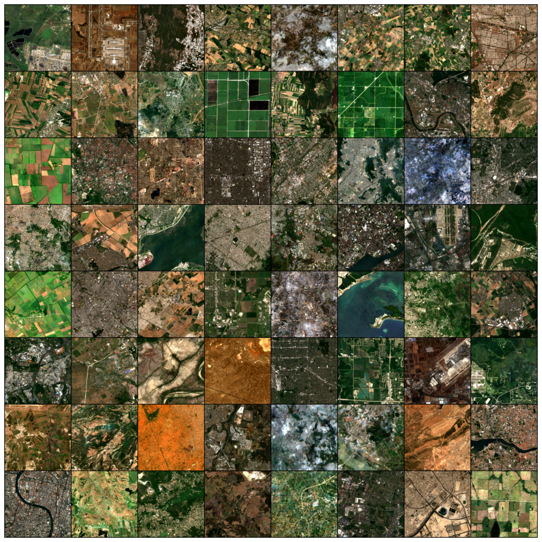
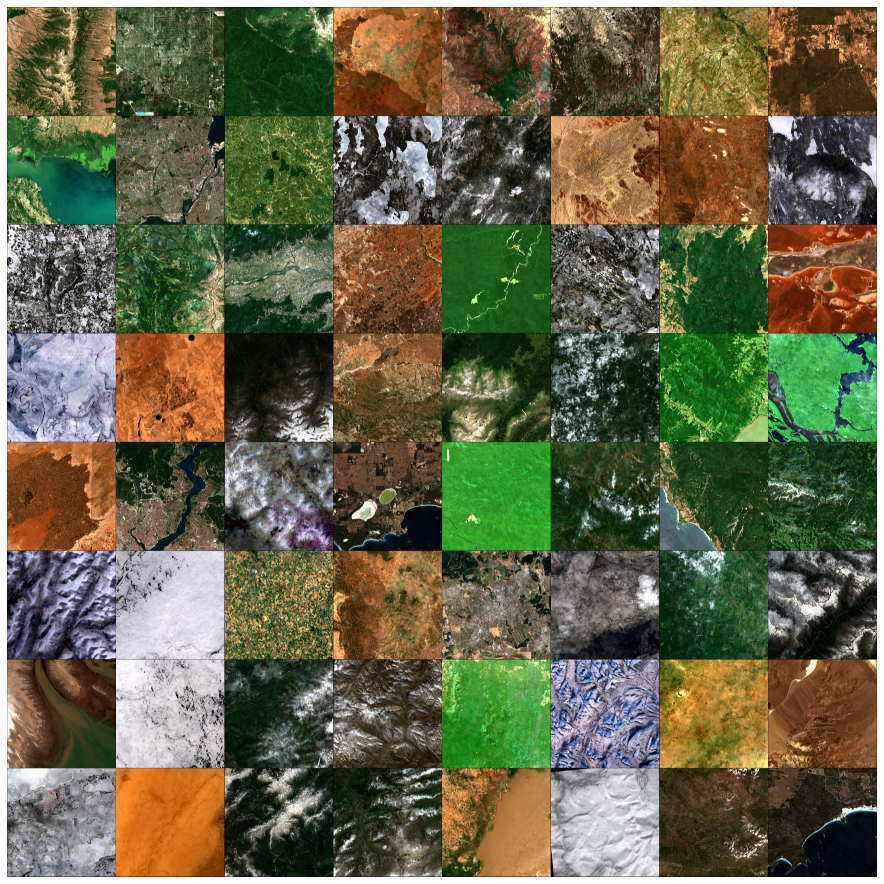

# MapInWild
This repository contains the code for the paper "[MapInWild: A Remote Sensing Dataset to Answer the Question What Makes Nature Wild](https://ieeexplore.ieee.org/document/10089830)". 

MapInWild dataset is available [here](https://dataverse.harvard.edu/dataverse/mapinwild). The [Python API](https://pydataverse.readthedocs.io/en/latest/user/basic-usage.html#download-and-save-a-dataset-to-disk) of the Harvard Dataverse can be used for [bulk actions](https://guides.dataverse.org/en/5.10.1/api/dataaccess.html). 

See the folders _segmentation_ and _sensitivity_ for the _SEMANTIC SEGMENTATION_ and the _SCENE CLASSIFICATION AND SENSITIVITY ANALYSIS_ experiments, respectively. 

A sample from MapInWild dataset is shown below. The first row: four-season Sentinel-2 patches, second row: Sentinel-1 image, ESA WorldCover map, VIIRS Nighttime Day/Night band, and World Database of Protected Areas (WDPA) annotation.


The files in the dataset are named after the ID of the protected area they contain. 
- For example, the filename of the sample above (555556115) can be easily traced back to the WDPA database: https://www.protectedplanet.net/555556115.

Batch visalualizations from MapInWild dataset:

- 256 x 256 patches

- 1920 x 1920 full-size patches 



Citation
---------------------
```
@ARTICLE{10089830,
  author={Ekim, Burak and Stomberg, Timo T. and Roscher, Ribana and Schmitt, Michael},
  journal={IEEE Geoscience and Remote Sensing Magazine}, 
  title={MapInWild: A remote sensing dataset to address the question of what makes nature wild [Software and Data Sets]}, 
  year={2023},
  volume={11},
  number={1},
  pages={103-114},
  doi={10.1109/MGRS.2022.3226525}}

```
