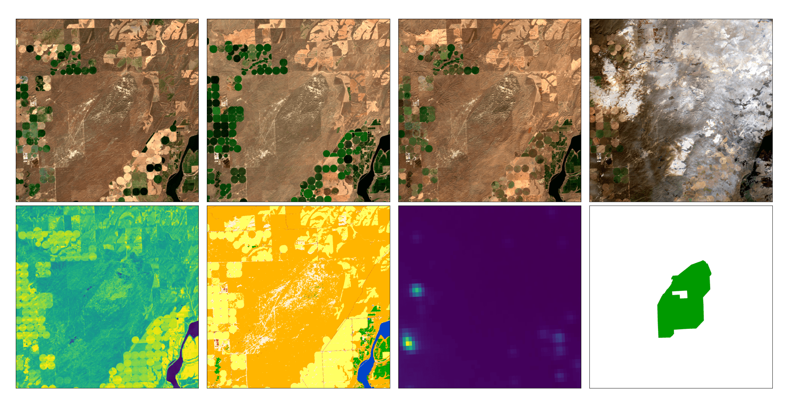

# MapInWild
This repository contains the code for the paper "MapInWild: A Remote Sensing Dataset to Answer the Question What Makes Nature Wild". See the folders _Sensitivity/mapinwild_sensitivity_ and _segmentation/mapinwild_segmentation_ for the _SCENE CLASSIFICATION AND SENSITIVITY ANALYSIS_ and the _SEMANTIC SEGMENTATION_ experiments. 

Citation
---------------------
TBD
